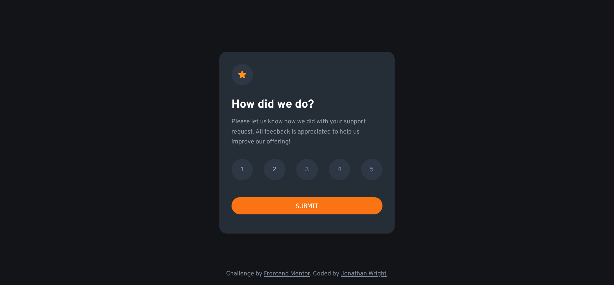

# Frontend Mentor - Interactive rating component solution

This is a solution to the [Interactive rating component challenge on Frontend Mentor](https://www.frontendmentor.io/challenges/interactive-rating-component-koxpeBUmI). Frontend Mentor challenges help you improve your coding skills by building realistic projects. 

## Table of contents

- [Overview](#overview)
  - [The challenge](#the-challenge)
  - [Screenshot](#screenshot)
  - [Links](#links)
- [My process](#my-process)
  - [Built with](#built-with)
  - [What I learned](#what-i-learned)
- [Author](#author)
- [Acknowledgments](#acknowledgments)


## Overview

### The challenge

Users should be able to:

- View the optimal layout for the app depending on their device's screen size
- See hover states for all interactive elements on the page
- Select and submit a number rating
- See the "Thank you" card state after submitting a rating

### Screenshot



### Links

- Solution URL: [https://www.frontendmentor.io/solutions/radio-button-heaven-TTgVAdJhW2](https://www.frontendmentor.io/solutions/radio-button-heaven-TTgVAdJhW2)
- Live Site URL: [https://dr-wrong-mo.github.io/fem__interactive-rating-component/](https://dr-wrong-mo.github.io/fem__interactive-rating-component/)

## My process

I considered a few different approaches to the rating buttons. I knew they needed to be clickable buttons that would change state when they were clicked and keep that state until the form was submitted, or another rating was selected. Instead of using a div and adding an event listener to it, I used something that has the behavior I wanted out of the box. Radio buttons. I needed to do some extra CSS work to get the style the way I wanted, but I think this saved me a lot of JavaScript work.

### Built with

- Semantic HTML5 markup
- CSS custom properties
- Flexbox
- Desktop-first workflow

### What I learned

With CSS, I had not previously targeted elements that had a specific data attribute value. In this case, I needed to target a radio button that was checked. In this case, I didn't want to change the values of the radio button itself. Instead, I needed to alter the style on the sibling. Here's what that looked like:


```css
input[type='radio']:checked + label {
  background-color: var(--light-grey);
  color: var(--white);
}
```

## Author


- Website - [Jonathan Wright](https://dr-wrong-mo.github.io/)
- Frontend Mentor - [@Dr-Wrong-Mo](https://www.frontendmentor.io/profile/Dr-Wrong-Mo)